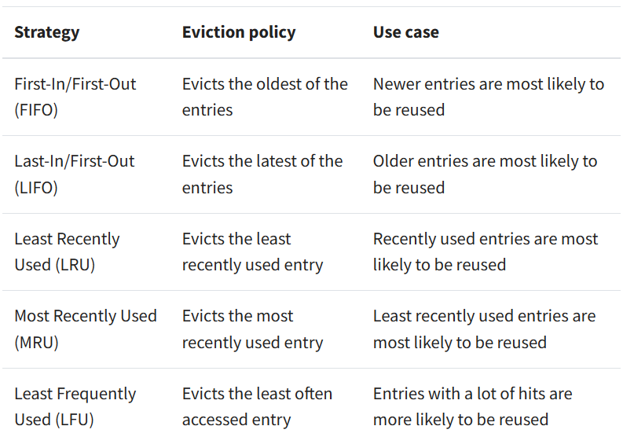

# Caching

## Learning Objectives
- What a caching system is
    - Caching is an optimization technique that you can use in your applications to keep recent or often-used data in memory locations that are faster or computationally cheaper to access than their source.
    - [Real Python](https://realpython.com/lru-cache-python/)
- What FIFO means
- What LIFO means
- What LRU means
    - Least Recently Used
- What MRU means
- What LFU means
- What the purpose of a caching system
- What limits a caching system have

## 